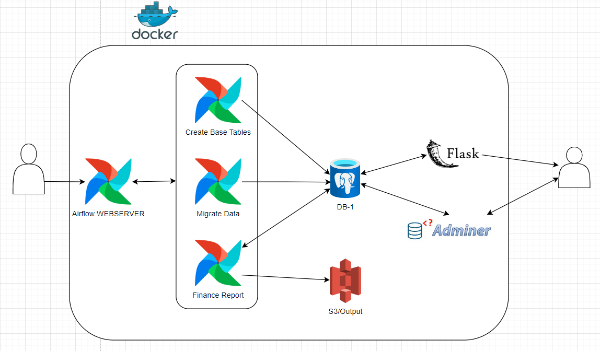
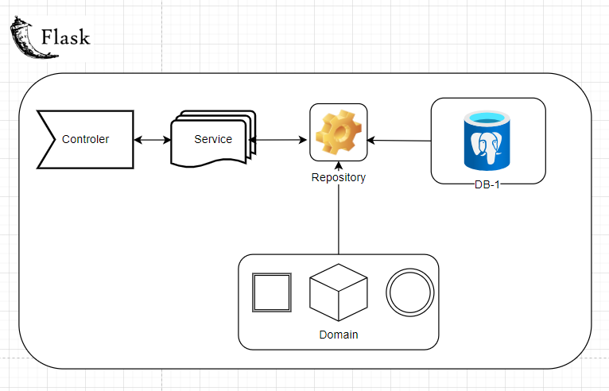

# Data Engineer Assessment
## Overview
This repository contains the assessment for the Data Engineer position. It includes a solution with three main components: ***airflow***, ***flask_app***, and ***inputs***. The solution is dockerized, and the containers are defined in the ***docker-compose.yaml*** file at the root level.

# Project Structure

## Airflow
* **dags**: Folder dedicated to the end-to-end data pipeline.

    * **queries**: Additional folder with Python files exporting variables as queries for different pipeline steps.
    * **dags.py**: Definition for the Airflow DAG.
* **outputs**: Folder used for the last step (Export report) to store the CSV file created for Finance.

# Flask_app
* **DockerFile**: File to build the custom Docker image for the API.
* **requirements**: File listing all dependencies needed to run the solution.
* **connection**: Python file creating the database connection (Postgres Container - DB-1, different from the Postgres container used for Airflow).
* **dataClass**: Python file with the DataClass definition used to map objects (Product, Metadata).
* **summary**: Python file defining objects for each API response (Cancelled, Shipped/Success).
* **service**: Python file acting as an intermediary between the controller (app.py) and the repository, responsible for building the summary (serialization).
* **repository**: Python file specialized in handling the last interactions during the request, specifically for database requests/responses.
* **app**.py: Main file to run the API (Controller), responsible for handling all requests and returning responses.

# Inputs
Folder containing files used as inputs (Raw Data). Includes a new file (**Platform_fees.csv**) used as a dimension to reference data without modifying queries.

## **Additional Findings**
* Some files (**Graded_products.csv - Grading_fees.csv**) had different data types or column configurations. **UPPER()** is used in SQL scripts to ensure consistent data usage in the final report.
* A "Slowly Changing Dimension" is created to keep a record of the **last_update** field. This is implemented with a **MERGE**, and the final date used for the report comes from this dimension/table.
* As part of the process, there is a step that homogenizes values for countries, as some countries are not present in **transport_cost.csv**, avoiding hardcoded values.

# How to Run
To run this solution, follow these steps:

1. Clone the repo: git clone **https://github.com/SweetAimP/assessment**
2. From the root folder, execute: **docker-compose up -d** to deploy the containers.
3. Unpause all the dags, and only execute the dag call **create_tables**.
4. Once everything is up, access the Airflow web server at **http://localhost:8080**.
5. The main Dag **Create_tables** will start running by itself as scheduled also will trigger the execution for the other two dags.
6. After the execution of the finance report DAG is finished, check the Output folder for the generated CSV file.
7. (Optional) To check the tables created during the process, log in to Adminer at **http://localhost:8088**, included in the ***docker-compose.yaml***.
    1. **Select** PostgresSQL (database)
    2. **User**: postgres
    3. **Password**: example
8. API Check: Now that everything is finished and the tables are ready, use curl to query the API server and list items using the License_plate. Example: curl http://127.0.0.1:5000/v1/item/BW221109148489. A "No record found" response is expected for non-existent License_plates.
